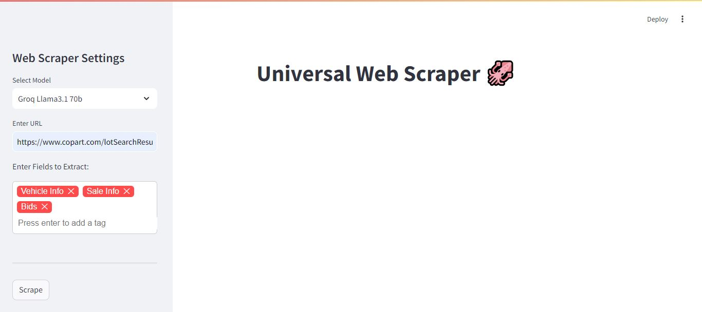
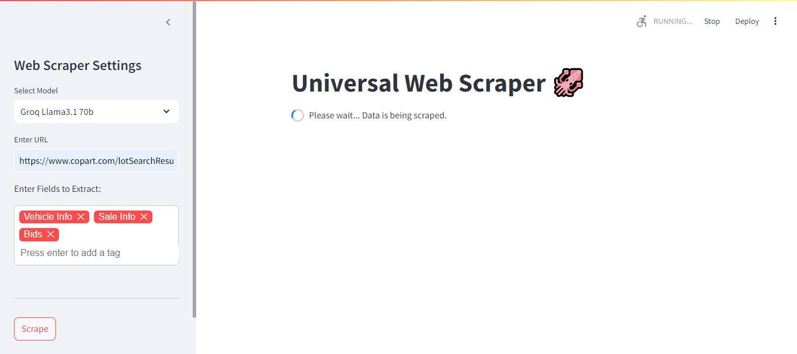
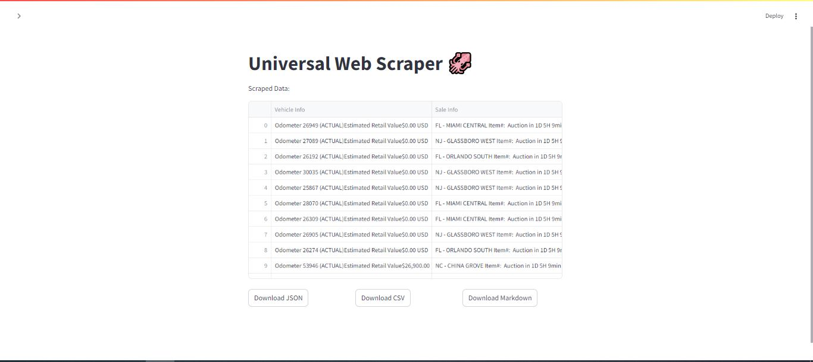
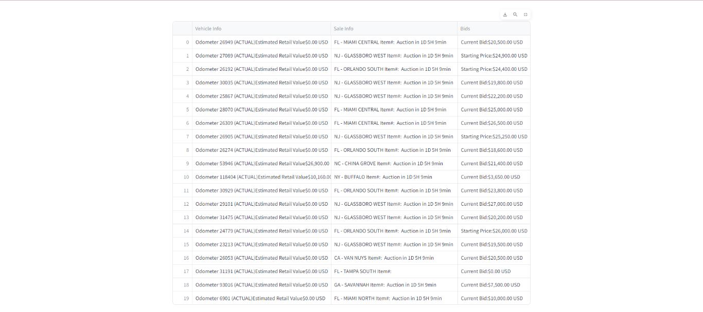

## App Overview

Here’s a quick look at the app:










# App Setup

### Follow these steps to set up and run the App.

## Clone the App from GitHub

First, clone the repository to your local machine:

```bash
https://github.com/h-wakaa/AI-Web-Scraper.git
```
Navigate into the App directory:

```bash
cd AI-Web-Scraper
```

## 1. Set Up Virtual Environment

Create a new folder for the App and set up a virtual environment:

```bash
python -m venv venv
```

### Activate the virtual environment:
- On Windows: 
  ```bash
  venv\Scripts\activate
  ```
- On macOS/Linux: 
  ```bash
  source venv/bin/activate
  ```

## 2. Install Dependencies

Create a `requirements.txt` file in your App folder and add the following libraries:

```text
openai
python-dotenv
pandas
pydantic
requests
beautifulsoup4
html2text
tiktoken
selenium
readability-lxml
streamlit
streamlit-tags
openpyxl
groq
google-generativeai
webdriver_manager
```

Install the dependencies by running:

```bash
pip install -r requirements.txt
```

## 3. Set Up API Keys

Create a `.env` file in your App directory and add the following API keys:

```env
GROQ_API_KEY=gsk_************************************************
OPENAI_API_KEY=sk-****************************************************************
GEMINI_API_KEY=AIza**************************************
```

## 4. Create `scraper.py`

This file will handle the scraping and parsing logic for your App.

## 5. Create `main.py`

This file will be responsible for running the main application logic.

## 6. Run the Application

To run the application using Streamlit, execute the following command:

```bash
streamlit run main.py
```
